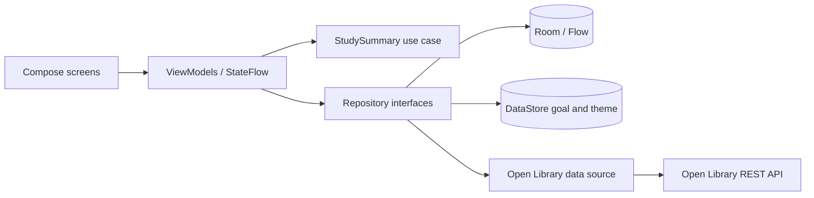

# StudyFlow — Study Tracker

A native Android study planner with a UI adapted from the supplied StudyFlow reference. This folder is the Android Studio project root; no GitHub remote or account is required.

## What you can do

- **Home:** see daily goal progress, today's sessions, a seven-day rhythm, recent topics, and cached study reading.
- **Topics:** search and filter by subject; add, edit, open, and delete topics. Three examples appear on first launch.
- **Topic details:** see actual topic time and session metrics, recent sessions, and launch a focus session.
- **Focus:** run a count-up timer, then save or discard the elapsed session with a confirmation sheet.
- **History:** see weekly volume, a seven-day chart, and dated session cards.
- **Settings:** save a daily goal and choose System, Light, or Dark appearance with Preferences DataStore.
- **Offline:** topics, sessions, and fetched books are observed from Room. Network failure never blocks local study features.

## Screenshots

Add emulator screenshots here after opening the project: `docs/screenshots/home.png`, `topics.png`, `topic-details.png`, `focus.png`, `history.png`, and `settings.png`.

## Visual design

The supplied UI reference informed the indigo and mint palette, rounded white cards, compact navigation, and paired **Plus Jakarta Sans** headings with **Inter** body text. Both fonts are bundled for offline rendering under their [Open Font Licenses](docs/licenses). The app also provides a dark palette based on the reference's nocturne design. The visual reference includes university accounts, cloud sync, mastery scores, and reminders; this local app does not display those as working features.

See [UI alignment notes](docs/ui-alignment.md) for a screen-by-screen mapping.

## Architecture

See [docs/architecture.md](docs/architecture.md) for a file map and event flow.

## Technology map

| Technology | Where to look |
|---|---|
| Kotlin + Coroutines + Flow | `ui/StudyViewModels.kt`, `data/repository/Repositories.kt` |
| Jetpack Compose + Material 3 | `ui/*/*Screen.kt`, `ui/theme/StudyTheme.kt` |
| Navigation Compose | `ui/navigation/StudyNav.kt` |
| MVVM + StateFlow | `ui/StudyViewModels.kt` |
| Room | `data/local/StudyDatabase.kt` |
| Preferences DataStore | `data/repository/Repositories.kt` |
| Retrofit + Moshi | `data/remote/OpenLibraryDataSource.kt` |
| Explicit dependency container | `StudyTrackerApplication.kt` |
| Use case | `domain/usecase/StudyUseCases.kt` |

## Open and build

1. Install a current stable Android Studio, a JDK supported by Gradle 8.14.5 (JDK 17–24), and Android SDK Platform 36.
2. In Android Studio choose **Open** and select this folder.
3. Let Gradle sync and download dependencies. The included Gradle wrapper uses Gradle 8.14.5.
4. Run the `app` configuration on an emulator or device with Android 8.0 (API 26) or newer.
5. From a terminal with JDK 17 and the SDK configured: `./gradlew testDebugUnitTest assembleDebug`. For the Room DAO instrumented test, start an emulator and run `./gradlew connectedDebugAndroidTest`.

`local.properties` is intentionally absent. Android Studio generates it for your local SDK path.

If Android Studio selects a newer bundled JDK, open **Settings → Build, Execution, Deployment → Build Tools → Gradle** and choose a JDK in the supported range. This checkout uses Android Studio's `GRADLE_LOCAL_JAVA_HOME` option with a machine-local `.gradle/config.properties`. A local `gradle.properties` also sets `org.gradle.java.home` so command-line builds started by Java 25 use a compatible daemon. These machine-specific files are ignored by Git; [gradle.properties.example](gradle.properties.example) shows the portable settings to copy in a new clone.

## API example

The optional **Refresh books** button calls Open Library's public [Search API](https://openlibrary.org/dev/docs/api/search) over HTTPS with the query `study skills`, limit 6, and only the `key,title,author_name` fields. No key or secret is needed. The remote data source parses a small response, and the repository saves valid books to Room. The UI observes Room, including when offline. Open Library is a public service: search relevance, availability, titles, authors, and response time can vary. A failed refresh shows a friendly message and leaves cached books untouched. Books are suggestions; they are not tied to topics or used for session tracking.

## Known limitations

- The active timer lives in its ViewModel and is not restored if Android kills the app. Save by pressing **End Session → Save and log session** before leaving the process.
- Today and week summaries assign the whole session to its start date; a session crossing midnight is not split.
- This is a single device sample with no account, sync, notifications, or background timer service.
- Database schema is version 1. A future schema change needs a Room migration.
- The book cache replaces matching keys but does not remove books omitted by later searches.

## Repository hygiene

`.gitignore` excludes generated output, IDE state, local SDK paths, and signing keys. No code has been pushed to GitHub.
